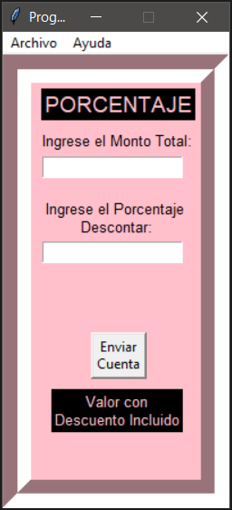

# Porcentaje - Python
Programa echo en Python, bajo un valor y un porcentaje inicial dado por el cliente, retorna el total con el porcentaje descontado.

## Para crear un Archivo ejecutable y poder usarlo:
- Descargar el Repositorio.
- Dentro de la carpeta del Repositorio ingresar los siguientes comandos:
    pip install pyinstaller
    pyinstaller --windowed --onefile --icon=./logo.ico Porcentaje.py

